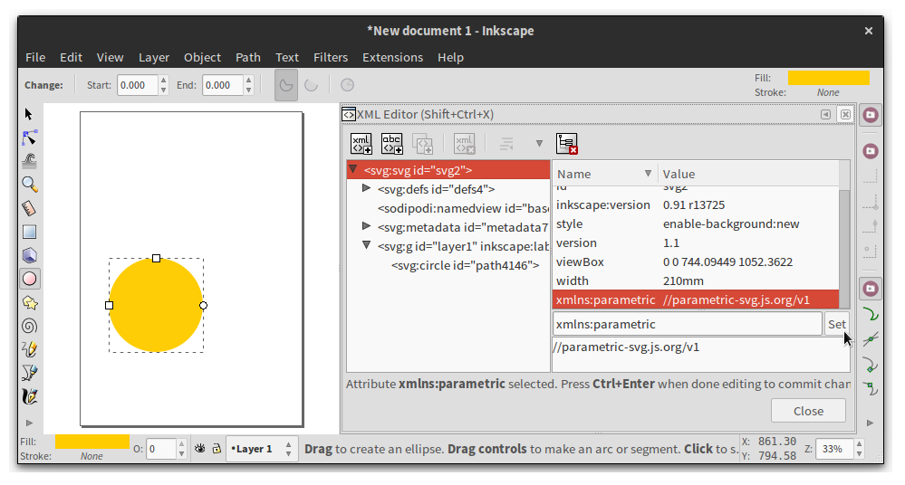

&nbsp;

Creating a parametric SVG
=========================

There are many ways to create a *parametric.svg* graphic. If you’re a designer or office person, you’d probably like to draw your things first and attach the parametric stuff later on. You’re in the right place – read on! If you’re more of a coder and want to hand-craft your SVG markup, you can skip right over to [the next section](#/online-editor).

You can make a parametric drawing in any SVG editor. There’s a fabulous free open-source one called [Inkscape][] – that’s what we’ll be using in this tutorial. Head over to [download][], install and start Inkscape. Come back when it’s up and running. We’ll still be here when you come!

***

Congratulations! Here’s what Inkscape v0.91 greets me with on a Linux machine. You probably see a similar window:

If you’ve ever fiddled with Adobe Illustrator, Corel Draw or even Microsoft Paint, I bet you feel right at home. Creating drawings in Inkscape is really easy.

Off we go then! Let’s start with something simple – we don’t want to make our first drawing too complicated. A circle is a good start. Just make sure you hold down <kbd>CTRL</kbd> while drawing – otherwise you’ll end up with more of an egg shape.

Well done! Our circle is a plain static SVG element. Let’s make its radius parametric! Inkscape ships with an XML editor – the perfect tool to get the job done. Let’s select the circle and pick the tool *Edit → XML Editor…* from the top menu.

> 💡
>
> You can add, edit and remove parametric attributes right inside Inkscape using the built-in *XML Editor*.

We’re greeted by a window split in two parts. On the left side there is a tree-like structure listing all elements in our drawing. On the right there are attributes of our circle. That’s what we’re interested in!

Under the list of attributes we have two input fields – one for setting the name of an attribute, the other for setting its value.

Right – let’s get our job done. We wanted to make the radius of our circle parametric. To do that let’s select the attribute `r` in the right pane – and change its name to `parametric:r` in the input field below.

> 💡
>
> Whenever you want to make an attribute parametric, just add the namespace prefix `parametric:` to it.

Adding the `parametric:` prefix will create a new attribute – it won’t remove the `r` we selected before. We wouldn’t want that – the `r` attribute is our fallback value. It will be used by Inkscape and other SVG viewers which don’t understand the *parametric.svg* format.

> 💡
>
> Any parametric attribute should have a static fallback – an attribute without the `parametric:` prefix.

We’ve just created our first parametric attribute. Our regular `r` attribute could only have a static value like `157.7027` – but
in our `parametric:r` we use any mathematical expression like `3 * (a + 50)` there.

> 💡
>
> The value of a parametric attribute can be virtually any [mathematical expression][]. It can also contain [variables][] and [strings][].

Now comes the big moment. Click the button *Set* or hit <kbd>CTRL + ENTER</kbd> on your keyboard to set the attribute! Hold your breath, and—

nothing happened? Inkscape can’t evaluate parametric attributes yet – it’s quite a new idea. In the next section we’ll learn how to use a web app to pass variables to our parametric graphic and evaluate the attribute we’ve created.

If you feel like it, you can set other parametric attributes on the circle. How about setting `parametric:style` to `concat('stroke: tomato; stroke-width: ' + string(2 * 3))`? Don’t worry if you don’t know exactly what it means. You can read up on our [specs][] later.

There’s one more thing we need to do before we close Inkscape. The `parametric:` prefixes we’ve been talking about should belong to an XML namespace. To make sure our file will open in every SVG viewer, we need to declare the namespace upfront. Click the topmost `<svg:svg>` element on the left side of the XML editor (it might as well be called `<svg>`). Then set the attribute `xmlns:parametric` to `//parametric-svg.js.org/v1` on it.

> 💡
>
> Remember to set the attribute `xmlns:parametric="//parametric-svg.js.org/v1"` on the root `<svg>` element. This way you’ll make sure your drawing opens anywhere.

Double-check you haven’t made a typo in the namespace stuff. Some SVG parsers are really strict beasts – a single mistyped character can confuse them so much that they can no longer open a drawing.

Alright! Let’s save our drawing somewhere. With all warnings out of the way we can now move on to the exciting part!

[Inkscape]:                 https://inkscape.org
[download]:                 https://inkscape.org/en/download/
[mathematical expression]:  https://github.com/parametric-svg/spec#/syntax
[variables]:                https://github.com/parametric-svg/spec#/syntax/variables
[strings]:                  https://github.com/parametric-svg/spec#/syntax/strings

&nbsp;

The online editor
-----------------

*A work in progress…*
